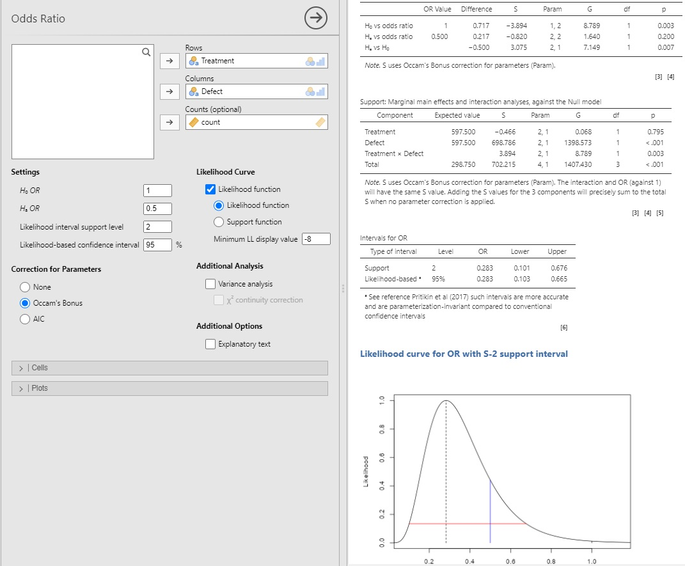

# jeva
A jamovi module for log likelihood ratio analyses of common statistical tests

The likelihood approach is one of several approaches to making
inferences from data. The best description and justification for the
approach is given by [Edwards, A.W.F. (1992) Likelihood, Johns Hopkins
Press](https://www.amazon.co.uk/Likelihood-W-F-Edwards/dp/0801844436/). Others, such as [R. Royall (1997)](https://www.amazon.co.uk/Statistical-Evidence-Likelihood-Monographs-Probability/dp/0412044110/), [S. Goodman (1988)](https://ajph.aphapublications.org/doi/abs/10.2105/AJPH.78.12.1568), [Z. Dienes (2008)](https://www.amazon.co.uk/Understanding-Psychology-Science-Introduction-Statistical/dp/023054231X/), [S. Glover & P. Dixon (2004)](https://link.springer.com/article/10.3758/BF03196706) have subsequently made important contributions. More recently useful contributions are by [Dennis et al (2019](https://www.frontiersin.org/articles/10.3389/fevo.2019.00372/full), and [Taper et al (2022)](https://www.frontiersin.org/articles/10.3389/fevo.2022.883456/full) 

The likelihood approach focusses on the observed data, using maximum
likelihood for estimates, and calculates likelihood ratios for specific
parameter values given the collected data. The log of the likelihood
is known as the *support*. When comparing two parameter values (as might be suggested by different hypotheses), the difference
in log likelihoods represents the ratio of their likelihoods. Using support has distinct advantages. It 
represents the weight of evidence with a scale that ranges
from positive to negative (indicating support for or against a hypothetical 
parameter value). Support values obtained from independent studies
can simply be added together to give their combined support. Unlike *p* values, 
support values are insensitive to transforms.

##		S value -- Interpretation of *H*1 vs *H*2
	S	LR	Interpretation
	0	1	No evidence either way
	1	2.72	Weak evidence
	2	Moderate evidence
	3	Strong evidence
	4	Extremely strong evidence
	7	More than a thousand to one
	14	More than a million to one
**Table 1:** _Interpretation for values of S, the support, calculated as the natural logarithm of the likelihood
ratio. Negative values would represent support for hypothesis values H2 vs H1. Typically, it is
sufficient to give S to one decimal place._

Support values give the relative strength of evidence for one hypothesis 
value versus another, see Table 1. They range from negative infinity to positive infinity. 
There is no specific threshold value (unlike 0.05 in frequentist testing), and
values can be rounded to the nearest 1 decimal place, e.g. -2.161 -> -2.2.
A support of 0 shows no support for either hypothesis, while a support of 1 
represents weak evidence for the first hypothesis versus the second. 
A support of 2 represents moderate evidence, and is roughly equivalent to the 
5% significance level in the frequentist approach. A support of 3 represents
strong evidence and 4 represents extremely strong evidence, and so on. 
Negative values represent the same strength of evidence, except for the 
second hypothesis value versus the first. Support values for a given likelihood
function can be compared with each other simply by subtracting them.

The log likelihood ratio interval (support interval) identifies a supported range of values which are 
consistent with the observed statistic. In jeva it is denoted as *S*-*X*, where *X* can 
be any number between 1 and 100. The *S*-2 interval is commonly used since it is numerically 
close to the 95% confidence interval. For this interval, it means that the values within the 
interval have likelihood ratios with each other in the range 0.135 to 7.38, corresponding to 
e^-2^ to e^2^. Simply put, within an *S*-2 interval, no likelihoods are more than 7.38 times 
different from each other. Similarly for the *S*-3 interval, likelihood ratios will range 
from 0.050 to 20.09, corresponding to e^-3^ to e^3^, and no likelihoods are more than 20.09 
times different from each other.

The support interval is different from the confidence interval. The latter represents the 
long run probability of capturing the
population parameter and may need to be corrected for multiple testing, stopping
rule, etc. The likelihood interval is also distinct from the Bayesian credibility
interval that represents the subjective probability for a population value occurring
within it.

There are few statistical packages that implement the likelihood
approach and which calculate support. This jamovi module calculates support for a range of statistical
analyses: *t* tests, ANOVA, regression, correlation and various categorical analyses. 

The analyses in the module complement my recent book: [Cahusac, P.M.B.
(2020) Evidence-Based Statistics, Wiley](https://onlinelibrary.wiley.com/doi/book/10.1002/9781119549833)  
[Amazon.co.uk](https://www.amazon.co.uk/Evidence-Based-Statistics-Introduction-Evidential-Statistical/dp/1119549809/)  

In jamovi the **.jmo** file can be sideloaded, and the module will appear among the other modules.
Example jamovi analyses with data from the book are given in the **Test Data Analyses - Blank** folder.

I would be interested in feedback <pcahusac@alfaisal.edu>          Peter Cahusac  

Below is a sample screenshot from jamovi showing the acquisition and results for an odds ratio analysis of the MRC study (1991) of neural tube
defects in babies born to mothers receiving either folic acid or placebo (double-blind randomized study), see pp 146 - 151 in Cahusac (2020) book.
<figure>

</figure>
